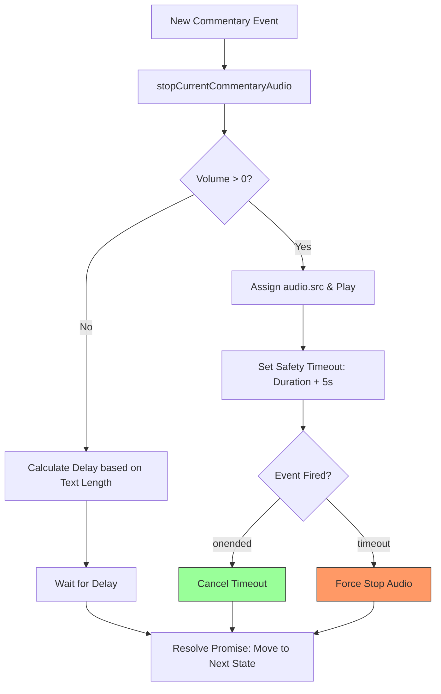

# Architecture Diagrams (June 2026 Updates)

This document provides visual representations of the core system updates implemented for security, audio synchronization, and multi-display logic.

---

## 1. Security & Authentication Flow
This diagram illustrates how the system protects expensive AI resources (Bedrock/Polly) using Cognito.

```mermaid
sequenceDiagram
    participant U as User (Browser)
    participant B as Node.js Bridge
    participant G as AWS API Gateway
    participant C as Cognito User Pool
    participant L as Lambda (Backend)

    Note over U, B: Local Environment
    U->>U: Login & Acquire JWT Token
    U->>B: POST /api/live-status (Header: Auth Token)
    
    Note over B, G: AWS Cloud Boundary
    B->>G: Forward Request + Auth Header
    
    rect rgb(40, 40, 60)
    Note right of G: Authorizer Check
    G->>C: Validate JWT Signature & Expiry
    C-->>G: Token Valid (200 OK)
    end
    
    G->>L: Invoke Lambda with User Context
    L->>L: Generate AI Commentary (Bedrock/Polly)
    L-->>G: Audio URL + JSON
    G-->>B: Response
    B-->>U: Play Audio
```



---

## 2. AWS Polly Playback & "Wait" Logic
This diagram explains how the system manages audio timing and ensures the game never gets stuck.



---

## 3. Player View Architecture (Dual Monitor)
This illustrates how video signals are routed depending on the user's role and display configuration.

```mermaid
flowchart LR
    subgraph HandTracker["HandTracker (Local Logic)"]
        HT[Gesture Detection]
        BV[BattleSync Broadcast]
    end

    subgraph Displays["Display Routing"]
        IP[Integrated Player<br/>(Main Browser)]
        PP[Popup Player Window<br/>(Secondary Screen)]
    end

    subgraph Network["Audience / Room"]
        SV[Spectator Viewer]
    end

    HT -->|Role = none| IP
    HT -->|Role = none| PP
    
    HT -->|Role = player1/2| PP
    HT -->|Role = player1/2| BV
    
    BV -->|WebSocket/BroadcastChannel| SV
    
    Note over IP: Hidden in Battle Mode<br/>to keep AR View clear
    Note over PP: Always Active<br/>via window.postMessage
```

---

## 4. REST vs WebSocket Authorization Methods
A comparison of the two security mechanisms used in the cloud.

| Component | Protocol | Security Mechanism | Responsibility |
| :--- | :--- | :--- | :--- |
| **Commentary API** | HTTPS (POST) | **Cognito Native Authorizer** | API Gateway automatically rejects unauthorized requests. |
| **Signaling Channel** | WSS (WebSocket) | **Custom Lambda Authorizer** | Manual JWT signature verification in [auth.py](file:///home/developer/Documents/data-disk/amazon-nova-robotics/domain-expansion-ar-game-serverless/backend/auth.py). |
| **Media Assets** | HTTPS (GET) | **Public / IAM** | Snapshots are public for `` tags; S3 assets protected by IAM. |
