# AWS Cloud System Architecture & Design Specification

This document provides a unified, comprehensive overview of the AWS cloud architecture powering the **Amazon Nova Robotics** ecosystem. The platform combines real-time humanoid voice control, text-based robot control, MCP-driven device tooling, and the gesture-controlled **Domain Expansion AR Game** on a primarily serverless AWS foundation.

---

## 🏗️ Unified AWS System Design Diagram

The following layered diagram illustrates the complete end-to-edge cloud infrastructure, showing how browser clients, API gateways, serverless compute, AI models, storage systems, and IoT-connected devices interact across the platform:

```mermaid
graph TB
    subgraph ClientLayer ["Client Layer"]
        BrowserVoice["Voice Chat Client (v1.0.11)"]
        BrowserText["Text Control Web UI"]
        ExternalSDK["External SDK / XiaoIce Client"]
        BrowserGame["Domain Expansion Web (AR Game)"]
        ThreeJSSim["Humanoid Simulator (Three.js)"]
        PhysicalRobots["Physical Robots / Drones / Dogs"]
    end

    subgraph EdgeLayer ["Edge & Delivery Layer"]
        CFVoice["CloudFront CDN (Voice Web)"]
        CFGame["CloudFront CDN (Game Web)"]
        CFSim["CloudFront CDN (Simulator Web)"]
        S3Voice[("S3 Bucket: Voice Web")]
        S3Game[("S3 Bucket: Game Web")]
        S3Sim[("S3 Bucket: Simulator Web")]
    end

    subgraph SecurityLayer ["Security & Identity Layer"]
        CognitoPool["Cognito User Pool (User Directory)"]
        CognitoIdent["Cognito Identity Pool (IAM Credentials)"]
    end

    subgraph InterfaceLayer ["Interface & Routing Layer"]
        APIGatewayText["API Gateway REST API (Text Control)"]
        APIGatewayGame["API Gateway REST API (Game)"]
        APIGatewayWS["API Gateway WebSocket API (Game Signaling)"]
        BedrockAgentRuntime["Bedrock AgentCore Gateway (SigV4)"]
    end

    subgraph ComputeLayer ["Compute & Orchestration Layer"]
        FastAPIAgent["FastAPI Container (Voice Agent Runtime)"]
        LambdaText["Lambda Handler (Flask Text Control)"]
        LambdaMCP["Lambda Function URL (Robotics MCP Server)"]
        LambdaGame["Lambda Handler (Python Game Backend)"]
        SQSGame[("Amazon SQS (Image Fusion Queue)")]
        LambdaWorker["Lambda Worker (Bedrock Image Fusion)"]
    end

    subgraph AIModelLayer ["AI Model Layer"]
        NovaSonic["Amazon Nova 2 Sonic"]
        NovaText["Amazon Nova 2 Lite / Nova Pro"]
        NovaCanvas["Amazon Nova Canvas"]
    end

    subgraph DataLayer ["Data & State Layer"]
        DDBGame[("DynamoDB: Game & Snapshot Sessions")]
        DDBRobots[("DynamoDB: Robot Configuration & Joints")]
        DDBSpeech[("DynamoDB: Speech / Presenter Messages")]
        S3Audio[("S3 Bucket: Polly Audio Assets")]
    end

    subgraph DeviceLayer ["Device & Messaging Layer"]
        IoTCore["AWS IoT Core (MQTT Message Broker)"]
    end

    %% Edge delivery
    CFVoice --> S3Voice
    CFGame --> S3Game
    CFSim --> S3Sim
    BrowserVoice -->|Pulls Static Assets| CFVoice
    BrowserGame -->|Pulls Static Assets| CFGame
    ThreeJSSim -->|Pulls Static Assets| CFSim
    BrowserText -->|Loads Web App / API Calls| APIGatewayText
    ExternalSDK -->|Signed HTTP / SSE Calls| APIGatewayText

    %% Identity & auth
    BrowserVoice -->|Sign In| CognitoPool
    BrowserText -->|Sign In| CognitoPool
    BrowserGame -->|Sign In| CognitoPool
    BrowserVoice -->|Exchange Token| CognitoIdent
    CognitoIdent -->|Temporary IAM SigV4 Credentials| BrowserVoice

    %% Voice path
    BrowserVoice -->|SigV4 WebSocket Handshake| BedrockAgentRuntime
    BedrockAgentRuntime -->|Bidirectional Streaming| FastAPIAgent
    FastAPIAgent -->|Speech-to-Speech Inference| NovaSonic
    FastAPIAgent -->|Tool Calls| LambdaMCP

    %% Text path
    APIGatewayText -->|Lambda Proxy| LambdaText
    LambdaText -->|Reasoning / Tool Selection| NovaText
    LambdaText -->|SigV4 JSON-RPC tools/list + tools/call| LambdaMCP
    LambdaText --> DDBRobots
    LambdaText --> DDBSpeech

    %% Game path
    BrowserGame -->|Public + Authenticated REST Calls| APIGatewayGame
    BrowserGame -->|Handshake with token secure| APIGatewayWS
    APIGatewayGame --> LambdaGame
    APIGatewayWS --> LambdaGame

    LambdaGame -->|Enqueue Image Requests| SQSGame
    SQSGame --> LambdaWorker
    LambdaWorker -->|Generate Image Fusion| NovaCanvas
    LambdaWorker -->|Update Snapshot Status| DDBGame
    LambdaGame --> DDBGame
    LambdaGame --> DDBRobots

    %% MCP execution path
    LambdaMCP -->|Robot / Dog / Drone / Speech Tools| IoTCore
    LambdaMCP --> DDBRobots
    LambdaMCP --> DDBSpeech
    LambdaMCP -->|Polly Audio Uploads| S3Audio

    %% Device sync
    IoTCore -->|MQTT Commands| PhysicalRobots
    IoTCore -->|MQTT Sync| ThreeJSSim
    FastAPIAgent --> DDBRobots
```



---

## 🎙️ Speech Control (Voice Web) Architectural Specifications

The Speech Control Cockpit is a high-performance, real-time voice streaming control interface powered by **Amazon Nova Sonic**.

### 1. Unified Authentication Protocol
* **The Flow**:
  1. The user logs in via a web interface (`/login.html`) against an **AWS Cognito User Pool**.
  2. The browser exchanges the Cognito Identity Token with an **AWS Cognito Identity Pool**.
  3. The Identity Pool vends short-lived, temporary AWS IAM credentials.
  4. The browser utilizes these credentials to cryptographically generate an **AWS Signature Version 4 (SigV4)** pre-signed handshake URL.
  5. The browser opens a secure WebSocket connection directly with the **AWS Bedrock AgentCore API Gateway** boundary.
* **Security Benefit**: Zero AWS secrets are stored on the frontend, and no custom middleware server is needed to sign connections. Authentications are handled entirely at the AWS Cloud frontier.

### 2. Live2D Real-time Lip-Sync Processing Engine (`v1.0.11`)
Standard Web Audio implementations often suffer from security limits, such as browsers suspending the active `AudioContext` until a manual user gesture occurs. To ensure perfect, bulletproof lip-syncing, we implemented an event-driven blending audio loop:

1. **Direct WebSocket RMS Extraction**:
   Upon receiving raw WebSocket audio streaming chunks (`audioOutput` event), the client immediately decodes the binary 16-bit PCM (`PCM_16`) array on the main loop and computes the raw **Root Mean Square (RMS)** amplitude:
   $$\text{rms} = \sqrt{\frac{1}{N}\sum_{i=1}^N \text{pcm}[i]^2}$$
   This RMS value is pushed instantly to the audio player via `audioPlayer.setWebSocketVolume(rms)`.

2. **Decay Envelope Tracking**:
   In `AudioPlayer.js`, a decay filter tracking variable (`websocketVolume`) is updated on each frame. If no new packets are received within $120\text{ms}$, the volume smoothly decays down to zero to close the mouth naturally:
   ```javascript
   if (elapsedTime > 120) {
       this.websocketVolume *= 0.85;
   }
   ```

3. **Multi-Source Audio Blending**:
   The Live2D Avatar update loop fetches the volume by blending speaker playback volumes and WebSocket packet volumes:
   $$\text{volume} = \max(\text{speakerVolume}, \text{websocketVolume})$$
   * **Result**: The avatar's mouth is **guaranteed to move instantly** when speech data arrives over the network, completely bypassing browser audio suspension limitations.
   * **Console Debugging**: Includes a real-time throttled console logger showing active calculations:
     `[Live2D Mouth Sync Debug] rawVolume=0.0384, targetMouthOpen=0.1075, smoothedVolume=0.0892`

---

## 💬 Text Control & Robot MCP Architectural Specifications

The Text Control service is the typed-command counterpart to the voice cockpit. It exposes a browser and SDK-friendly HTTP/SSE API, uses a Bedrock-hosted text model for reasoning, and delegates all physical device execution to a dedicated **robotics MCP server**.

### 1. Text Control Request Path
The deployed text surface is an **API Gateway REST API** backed by a **Flask application running on AWS Lambda**.

1. A browser client or external SDK calls `/api/chat`, `/api/talk`, `/api/xiaoice-chat-api-strands`, or `/api/xiaoice-chat-api-strands-stream`.
2. API Gateway forwards the request into the `text_control` Lambda runtime.
3. The Flask app applies the appropriate auth mode:
   * **Cognito/session-backed auth** for the interactive web UI routes.
   * **Signature-based XiaoIce protocol auth** (`X-Key`, `X-Sign`, `X-Timestamp`) for SDK-compatible chat endpoints.
4. The route layer enriches the request with robot context from **DynamoDB** and creates a per-session Strands agent.
5. The agent generates a response and, when action is required, calls one or more MCP tools to execute robot, dog, or drone operations.

### 2. Bedrock Text Model Layer
The text orchestration path uses a **Strands `BedrockModel`** as the reasoning engine for typed requests.

* **Current implementation default**: `us.amazon.nova-2-lite-v1:0`
* **Purpose**: Intent interpretation, multi-step tool selection, multilingual response generation, and session-aware follow-up handling.
* **Design note**: The text-control stack is model-pluggable. The surrounding Lambda + Strands + MCP architecture does not change if the deployment is upgraded to a larger **Amazon Nova 2 / Nova Pro-class** text model for deeper reasoning.

This means the system already separates:

| Surface | Model role | Current implementation |
| --- | --- | --- |
| Voice cockpit | Real-time speech-to-speech streaming | `amazon.nova-2-sonic-v1:0` |
| Text control | Text reasoning and tool orchestration | `us.amazon.nova-2-lite-v1:0` |
| AR image fusion | Image generation | `amazon.nova-canvas-v1:0` |

### 3. Robotics MCP Server as the Action Plane
The **MCP server** is deployed as a separate **AWS Lambda Function URL** with **AWS IAM / SigV4** protection and acts as the system's canonical tool execution boundary.

* The Text Control Lambda never publishes raw robot actions directly through ad hoc HTTP handlers when operating in agent mode.
* Instead, it uses an **AWS SigV4-authenticated MCP client** to:
  1. call `tools/list`,
  2. dynamically materialize MCP tools into Strands-compatible tool objects, and
  3. call `tools/call` for the selected device action.

The MCP server currently registers **92 tools** across these domains:

* **Robot tools**: humanoid locomotion, posture, combat, exercise, and pose actions
* **Dog tools**: quadruped movement, gestures, and advanced routines
* **Drone tools**: takeoff, landing, movement, and rotation controls
* **Dance tools**: choreography and showcase behaviors
* **Speech tools**: Amazon Polly-based text-to-speech broadcast to robots
* **Image/XiaoIce tools**: supporting media and external assistant workflows

### 4. Device Command Delivery
After a tool is selected, the MCP server becomes the operational control plane:

1. The MCP Lambda validates tool arguments and maps them to device executors.
2. Executors publish standardized commands to **AWS IoT Core MQTT topics** such as `robot_*/topic`, `dog_*/topic`, `drone_*/topic`, and `xiaoice_*/topic`.
3. Physical robots and the browser-based simulator consume the same command stream, which keeps digital twins and real hardware synchronized.
4. For speech playback, the MCP server synthesizes audio with **Amazon Polly**, uploads it to **Amazon S3**, creates a presigned URL, and publishes that URL through IoT for device playback.

### 5. Why This Split Architecture Matters
This Text Control + MCP decomposition cleanly separates concerns:

* **API Gateway + Flask Lambda** handles web/API protocol compatibility, auth, session management, and streaming responses.
* **Bedrock text models** decide intent and tool selection.
* **The MCP Lambda** owns the executable robotics tool catalog.
* **AWS IoT Core** remains the single transport layer to real devices and simulators.

This provides a stable contract for future expansion: new tools can be added inside the MCP server without redesigning the text UI, and the Bedrock model tier can be upgraded independently from the robot execution tier.

---

## 🎮 Domain Expansion Game Architectural Specifications

The JJK Domain Expansion AR Game incorporates high-fidelity hand sign gesture recognition using MediaPipe and interacts serverlessly with the AWS Cloud.

### 1. Secure Split-Routing REST Architecture
To deliver a secure game that perfectly integrates with native browser media elements (which cannot attach custom HTTP bearer authorization headers), we designed a **split-route API Gateway Rest API**:

* 🔒 **Cognito Protected Endpoints (Catch-All Proxy `/{proxy+}`)**:
  * Critical HTTP methods like `/api/enhance-portrait` (triggering expensive Bedrock Canvas style fusions), `/api/register-room`, `/api/live-status`, `/api/battle-result`, and `/api/trigger-technique` (orchestrating server-side JJK techniques) are proxy-mapped to the AWS Lambda backend.
  * **Server-Side Orchestration (`/api/trigger-technique`)**: Hand sign gestures and techniques are now sent directly to the serverless backend. The Lambda handler uses a server-defined mapping dictionary (`JJK_ACTION_MAP`) to translate JJK techniques to physical robot simulator actions, concurrently calling (1) the simulator REST endpoint and (2) the asynchronous MCP `robot_speak` tool for AWS Polly synthesized audio. This migrates high-fidelity cloud orchestration from client browser to backend server.
  * They are protected by an **API Gateway Cognito User Pools Authorizer**. If the client request lacks a valid Cognito bearer token, API Gateway drops the query instantly with a `401 Unauthorized` response.
* 🔓 **Public Media Access (`/api/get-snapshot` & `/api/last-image`)**:
  * Because standard browser HTML image elements (e.g., ``) fetch images natively and cannot append custom authorization headers, protecting image retrievals with Cognito would prevent pictures from loading.
  * We explicitly defined these two read-only endpoints as **explicit API Gateway resources** with `AuthorizationType.NONE`.
  * Because they are read-only and require a valid, secret `sessionId` (e.g., `"mcpserver"`) to locate the snapshot, they are completely safe from malicious exploits while allowing images to render flawlessly.

### 2. High-Performance Battle Mode Real-Time Sync
* **WebRTC P2P Signaling**: 
  The game supports local and online multiplayer modes. In online mode, browsers establish a secure, encrypted peer-to-peer **WebRTC** connection to stream user camera views directly between players' screens.
* **WebSocket Signaling**:
  The game's Socket.io / API Gateway WebSocket connection acts only as a lightweight room coordination signaling switchboard. It handles only game coordinates, technique triggers, and score broadcasts (never seeing camera streams), saving maximum cloud bandwidth and keeping latencies minimal.

### 3. Consolidated `"mcpserver"` Default Session Key
* **Standardization**: Both frontend elements ([battle.js](file:///home/developer/Documents/data-disk/amazon-nova-robotics/domain-expansion-ar-game/static/js/battle.js), [hand_tracker.js](file:///home/developer/Documents/data-disk/amazon-nova-robotics/domain-expansion-ar-game/static/js/hand_tracker.js)) and cloud backend components ([lambda_function.py](file:///home/developer/Documents/data-disk/amazon-nova-robotics/domain-expansion-ar-game-serverless/backend/lambda_function.py), [image_processor.py](file:///home/developer/Documents/data-disk/amazon-nova-robotics/domain-expansion-ar-game-serverless/backend/image_processor.py), [commentary.py](file:///home/developer/Documents/data-disk/amazon-nova-robotics/domain-expansion-ar-game-serverless/backend/commentary.py)) default to a standard `"mcpserver"` session ID.
* This ensures that any battles fought, snapshots captured, or commentaries generated are seamlessly integrated and accessible by your conversational agents.
