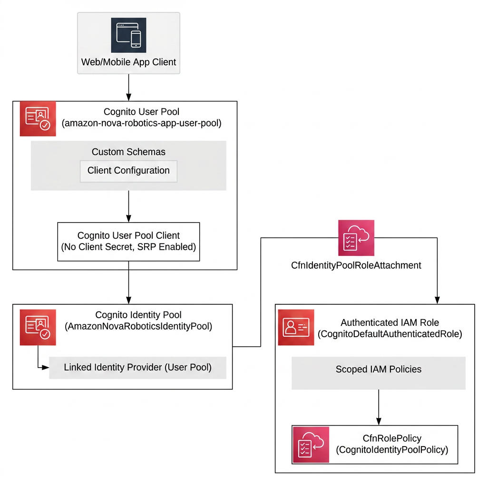
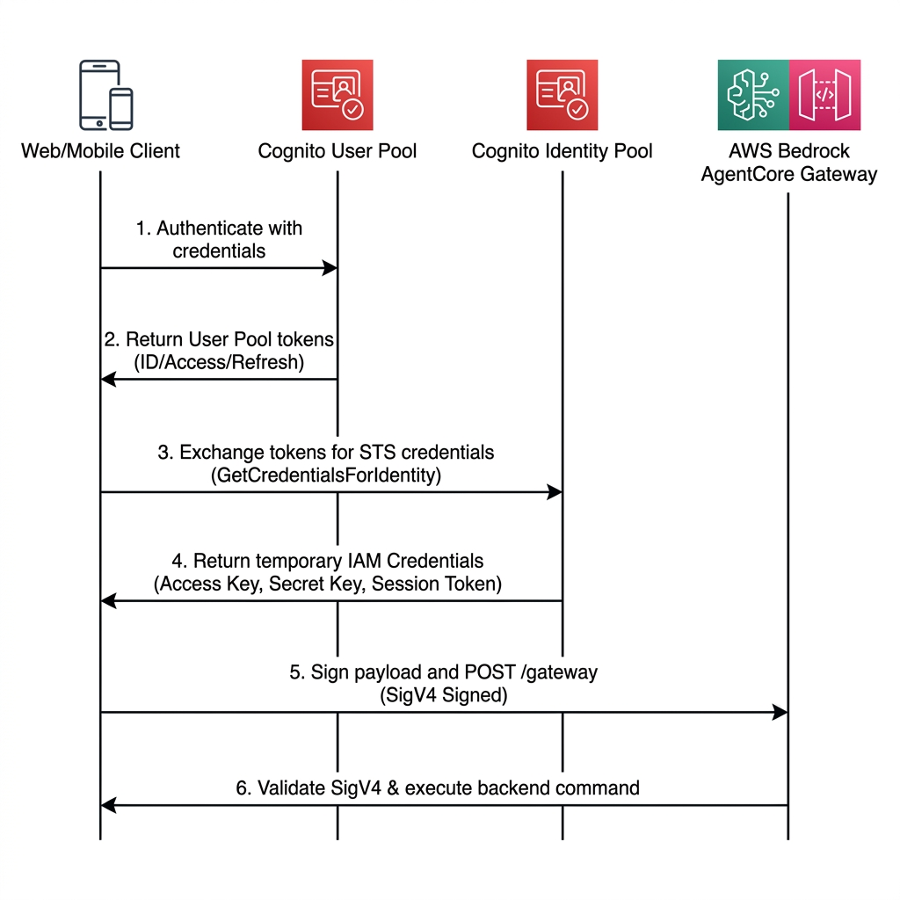

# Authentication & Authorization Design Specification (Authenticator)

This document details the architectural design of the custom `Authenticator` Construct, analyzing how the system leverages Amazon Cognito and AWS STS to provide a stateless, high-security, dynamic SigV4 credential federation.

---

## 1. Resource Composition & Structure

The `Authenticator` Construct is built using the following L1/L2 AWS CDK resources, creating a unified authentication pillar for control interfaces and multi-modal integrations.



### A. Cognito User Pool
* **Purpose**: Centralized management of authorized operators.
* **Configuration Highlights**:
  * `selfSignUpEnabled: false`: Disables self-registration. This guarantees that only explicitly invited administrators or operations staff can gain access to control lanes.
  * `signInAliases: { email: true }`: Configures email as the primary login alias.
  * `standardAttributes: { email: { required: true, mutable: true } }`: Enforces valid emails as mandatory user attributes.
  * `userVerification: { emailStyle: VerificationEmailStyle.CODE }`: Delivers numeric verification codes instead of standard links, reducing link-hijacking risks.

### B. Cognito User Pool Client
* **Purpose**: Allows front-end browser clients to connect to the User Pool.
* **Configuration Highlights**:
  * `generateSecret: false`: As browser single-page apps (React/Vite) cannot securely store static secrets, client secrets are omitted to prevent leakage.
  * `authFlows`: Enables secure password SRP flow (`userSrp`), password flow (`userPassword`), and admin flow (`adminUserPassword`) to support multiple runtime clients.

### C. Cognito Identity Pool
* **Purpose**: Translates authenticated Cognito IDs into short-lived AWS IAM credentials.
* **Configuration Highlights**:
  * `allowUnauthenticatedIdentities: false`: Rejects guest/anonymous identities. Every request must present a valid User Pool identity.
  * `cognitoIdentityProviders`: Explicitly registers the active User Pool and Client as a trusted federation provider.

### D. Authenticated IAM Role
* **Purpose**: Holds precise, minimum-privilege credentials assigned to active sessions.
* **Trust Relationship (Trust Policy)**:
  * Trusted Principal: `cognito-identity.amazonaws.com` (STS role federation).
  * Conditions: Restricts `aud` (Audience) to the specific Identity Pool ID, and requires authentication method references (`amr`) to be explicitly `authenticated`.
  * Action: Grant permission to perform `sts:AssumeRoleWithWebIdentity` (Credential swap).

---

## 2. Dynamic SigV4 Flow & Credential Exchange

The sequence below illustrates how a web client securely authenticates, exchanges credentials, and dispatches a signed movement payload to the cloud:



### Authorization Architecture Key Takeaways
1. **Zero Static Credentials**: Front-end code bases never store static IAM access keys, eliminating leak scenarios.
2. **Ephemeral Lifespans**: STS temporary credentials expire automatically after 1 hour, minimizing the utility of stolen session tokens.
3. **Integrity & Replay Resistance**: SigV4 signatures hash the payload along with timestamp headers, protecting requests against mid-flight tampering and unauthorized replays.

---

## 3. Resource Lifecycles & Deletion Policies

Within the `Authenticator` construct, resources are configured with:
```typescript
removalPolicy: RemovalPolicy.DESTROY
```

### Sandbox Agility Consideration
In standard production templates, User Pools holding critical user data are set to `RETAIN` (preserved after stack deletion). However, in fast-paced sandbox, development, and testing envs:
* **Frictionless Rebuilds**: Rapid iteration of `cdk deploy` and `cdk destroy` requires clean-slates. Retaining User Pools leads to name collisions, isolated orphaned resources, and manual console cleanups.
* **Cost Efficiency**: Automating destruction cleans up all configurations and directories upon stack deletion, avoiding passive resource accumulation.

> [!WARNING]
> **Production Upgrade Requirement**:
> When promoting this CDK template to a production environment, you MUST modify the `removalPolicy` of the `UserPool` to `RemovalPolicy.RETAIN` to prevent catastrophic, accidental deletion of user accounts and authentication states during manual stack operations.
