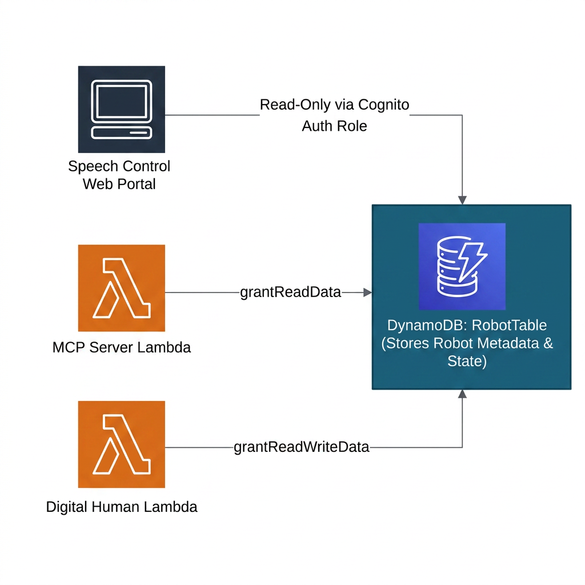

# Database Design Specification (Database)

This document details the architectural specifications of the system's database storage layer. The system uses AWS DynamoDB (TableV2) as a serverless, highly-scalable, and low-latency database for robot metadata, telemetry states, and digital human speech presenter cache structures.

---

## 1. DynamoDB Specifications

The primary database is declared within `DatabaseConstruct` and instantiates a fully-managed DynamoDB NoSQL table named `RobotTable` (with physical names resolved dynamically based on stack IDs).

### A. Key Specifications & Parameters

| Parameter | Configuration | Design Rationale |
| :--- | :--- | :--- |
| **Table Class** | `TableV2` | Leverages the latest AWS CDK L2 database construct, ensuring default integration with modern backup and recovery options. |
| **Partition Key (PK)** | `id` (AttributeType.STRING) | Uses the unique device identifier (e.g., `robot_1`, `drone_2`, `xiaoice_1`) as the partition key, guaranteeing even data partition distribution and sub-millisecond query results. |
| **Billing Mode** | `Billing.onDemand()` | On-demand capacity mode (Pay-per-request). Best suited for fluctuating telemetry rates and sandbox environments, completely avoiding reserved capacity (WCU/RCU) costs when idle. |
| **PITR Status** | Disabled (`pointInTimeRecoveryEnabled: false`) | Deactivated during development and sandbox testing to minimize backup storage expenses. |
| **Removal Policy** | `RemovalPolicy.DESTROY` | Fully purges the physical DynamoDB table upon CDK stack destruction to support clean test environments. |

---

## 2. Security & IAM Grant Model

Following the "Least Privilege" security principle, no external actor or compute resource can interact with the `RobotTable` without explicit, cryptographically-signed authorization. 

CDK simplifies these policy attachments through dynamic `grant` methods:



* **MCP Server Privileges**:
  * By invoking `props.database.robotTable.grantReadData(this.mcpFunction)`, the system grants the MCP Lambda **read-only access** (`dynamodb:GetItem`, `dynamodb:BatchGetItem`, `dynamodb:Query`, `dynamodb:Scan`). This locks down the telemetry plane, preventing administrative helper functions from modifying core configuration schemas.
* **Telemetry Data Structure Example**:
  * Each robot state payload is recorded as a structured NoSQL Item:
    ```json
    {
      "id": "robot_1",
      "type": "humanoid",
      "status": "online",
      "lastActive": "2026-06-12T07:12:30Z",
      "battery": 92
    }
    ```

---

## 3. Lifecycles & Deletion Safety

Like the authentication stack, the database is configured with `RemovalPolicy.DESTROY`:

* **Development Advantages**:
  * **No Data Pollution**: Modifying database schemas or telemetry variables during sprints often requires clean states. `DESTROY` ensures that a simple `cdk destroy && cdk deploy` provides an empty, fresh database schema without residual, corrupted mock items.
  * **Cost Control**: Eliminates passive storage retention fees on inactive sandbox tables after teardowns.

> [!CAUTION]
> **Production Safety Warning**:
> In a production deployment, you MUST modify the database construct `removalPolicy` to `RemovalPolicy.RETAIN`.
> Failure to do so will cause catastrophic, irreversible data loss of all telemetry logs, device configurations, and production historical data upon accidental stack deletions or configuration rollbacks!
