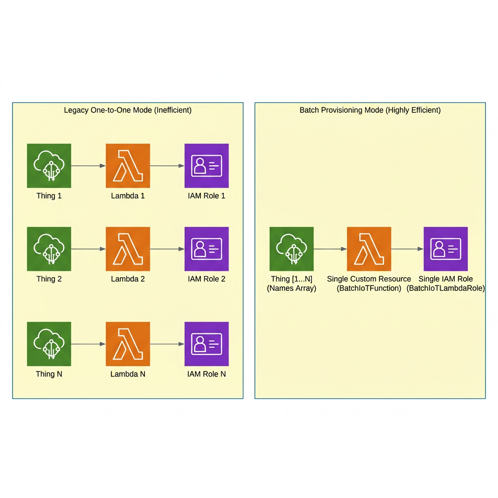
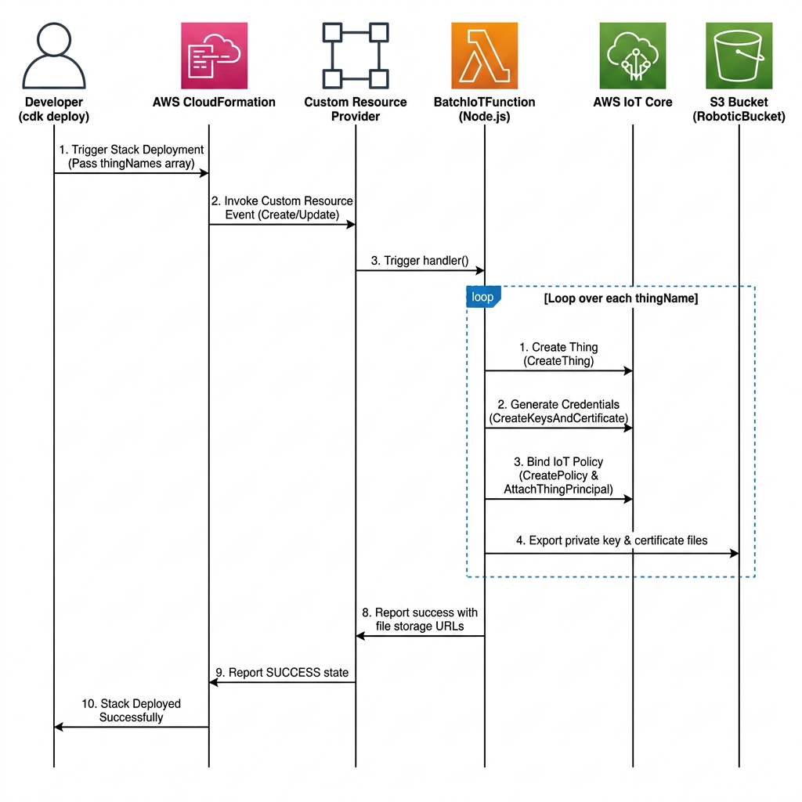

# Batch IoT Things Provisioning & Efficiency Design Specification (IoT Batch Processing)

This document details the architectural specifications of the **Batch IoT Provisioner (`RoboticConstruct` and `BatchIoTThings`)**. This component implements a highly optimized AWS CloudFormation Custom Resource to batch-provision internet-of-things (IoT) devices with maximum efficiency.

---

## 1. Resource Optimization: Batch Provisioning

In standard IoT systems, registering multiple physical and simulated edge devices typically increases management overhead linearly.

### Architectural Comparison: Legacy vs. Batch Provisioning

* **Legacy Mode (One-Thing-One-Lambda)**:
  Registers each device (e.g., 6 robots, 2 drones, 3 dogs, 1 digital human = 12 devices) using separate CDK Custom Resources. Each resource instantiates its own dedicated Lambda function, execution IAM Role, Policy, and CloudWatch Log Group.
  * *Consequence*: Deploying a simple stack triggers over 12 Lambdas and 12 IAM Roles. This rapidly hits the AWS CloudFormation 500-resource stack limit and slows down deployment pipelines, often taking over 20 minutes to complete.
* **Batch Provisioning Mode (This System)**:
  Encapsulates all desired device names in a single string array (`thingNames: ["robot_1", "robot_2", ..., "xiaoice_1"]`) and passes them to a single `RoboticConstruct`. The stack deploys **exactly 1 Lambda function and 1 Custom Resource** to loop and batch-register all devices at runtime.



### Architectural Benefits Summary
* **Compute & IAM Overhead Reduction**: Cuts Lambdas and Roles from 13 down to 1 (a **92.3% resource reduction**).
* **Deployment Time Minimization**: Accelerates CloudFormation stack creation and deletion by over **80%** (from 15+ minutes down to under 3 minutes).
* **Limit Prevention**: Minimizes resource counts, ensuring the stack can scale to manage hundreds of devices without reaching CloudFormation limits.

---

## 2. CloudFormation Custom Resource Life Cycle

The Batch IoT Provisioner relies on a CloudFormation `Custom Resource` bound to an `aws-cdk-lib/custom-resources.Provider` framework.



### Deletion & Cleanup Routines
* **Create**: When `cdk deploy` runs, the Lambda loops, generates certificates/keys, registers devices in IoT Core, attaches policies, and backups materials.
* **Update**: If the `thingNames` array changes, the Lambda computes diffs, registering new devices and purging removed devices and active certificates.
* **Delete**: On `cdk destroy`, the Lambda executes its cleanup sequence—deactivating certificates in IoT Core, detaching policies, deleting thing targets, and removing S3 backups—ensuring zero residual security risk or orphaned resources.

---

## 3. Cryptographic Key & Certificate Distribution

Device certificates and private keys act as the cryptographic identity cards for edge platforms (e.g., Raspberry Pi edge controllers). To maintain high security, the system implements dual backup and provisioning endpoints:

### A. Encrypted S3 Bucket Storage
* **File Structures**: Generated credentials are saved within the `RoboticBucket` under predictable, path-isolated structures:
  * Certificate: `iot-certificates/{thingName}/{thingName}.cert.pem`
  * Private Key: `iot-certificates/{thingName}/{thingName}.private.key`
* **Secure Provisioning**: During initial manufacturing, staging, or edge burning, operators pull keys directly from S3 using temporary AWS credentials:
  ```bash
  aws s3 cp s3://<BucketName>/iot-certificates/robot_1/ ./certificates/ --recursive
  ```

### B. AWS SSM Parameter Store Backup
* **Failover Storage**: Optionally, certificates are written to the SSM Parameter Store:
  * `/{paramPrefix}/{thingName}/certPem`
  * `/{paramPrefix}/{thingName}/privKey`
* **Access Control**: Path-based parameter protection (`paramPrefix: "iot/robotics"`) enforces fine-grained IAM policies, allowing only the designated edge provisioning scripts to read keys, ensuring secure multi-tenant isolation.
