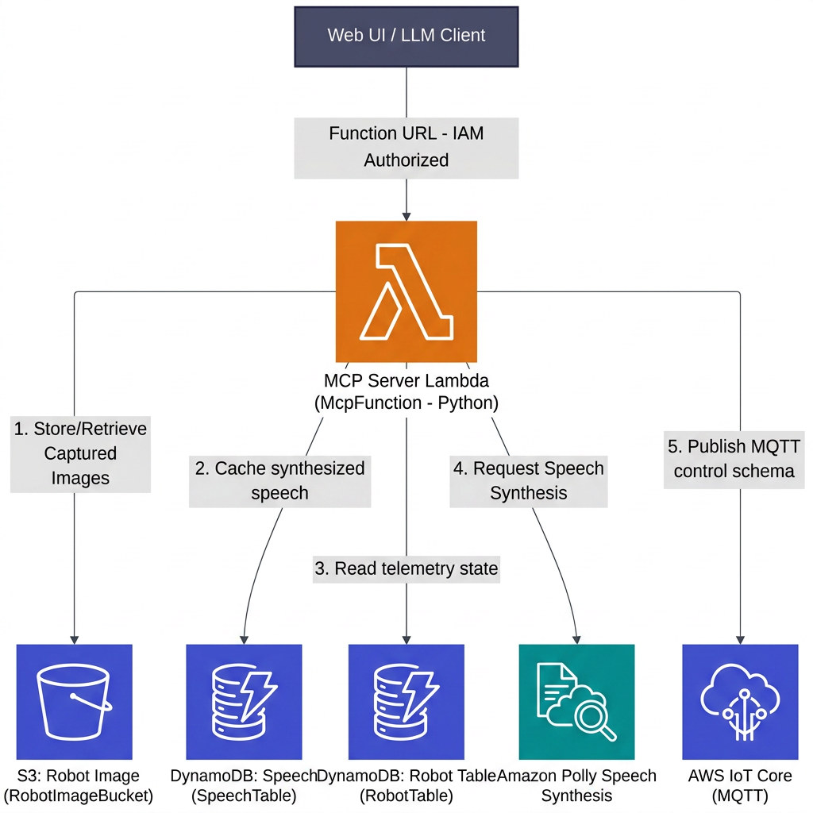

# MCP Server & Multimodal Processing Design Specification (MCP Server)

This document details the architectural design of `LambdaMcpServerConstruct`. This construct serves as the serverless Model Context Protocol (MCP) core, orchestrating robot telemetry lookup, Polly speech synthesis, S3 imagery pipelines, and AWS IoT Core publishing.

---

## 1. Topological Layout & Resource Interactions

The MCP Server acts as an orchestrator and translator between Large Language Models (LLM) and physical actuators/digital human representations, interfacing with multiple AWS services:



### A. Key System Resources
1. **SpeechTable (DynamoDB)**: Caches Xiaoice digital human audio configurations. By storing text-to-speech mappings, the system avoids redundant calls to Amazon Polly, minimizing latency and platform synthesis fees.
2. **RobotImageBucket (S3)**: Houses real-time JPEG/PNG snapshots uploaded by robots.
   * *CORS Configuration*: Enabled for `GET` and `PUT` with wildcard origins (`*`), enabling web portals to directly and securely stream camera frames on client browsers.
   * *Auto-Purge*: Configured with `autoDeleteObjects: true` and `RemovalPolicy.DESTROY` to wipe image files and prevent storage leaks on stack teardowns.
3. **McpFunction (Python Lambda)**:
   * Built on `SHARED_PYTHON_RUNTIME`.
   * Timeout: **30 seconds** (provides sufficient headroom for network-bound LLM agents, Polly compilation, and S3 file operations).
   * Environment variables injected to couple compute and storage scopes:
     * `IMAGE_BUCKET_NAME`
     * `SpeechTable`
     * `RobotTable`
     * `SIMULATOR_ENDPOINT`

---

## 2. Least Privilege IAM Permissions

To protect compute lanes against arbitrary execution or injection vectors, the McpFunction’s IAM role is highly isolated:

### A. Storage & Database Actions
* `imageBucket.grantReadWrite(this.mcpFunction)`: Scoped only to the image S3 bucket.
* `speechTable.grantReadWriteData(this.mcpFunction)`: Read-write scoped to the speech cache.
* `props.database.robotTable.grantReadData(this.mcpFunction)`: Grants strict read-only access to telemetry metadata, preventing write overrides.

### B. AWS IoT Core Topic Boundaries
The Lambda cannot broadcast messages globally; it is strictly bounded to the system's exact robot and presenter topic segments:
```typescript
actions: ["iot:Publish", "iot-data:Publish"],
resources: [
  "arn:aws:iot:*:*:topic/robot_*/topic",
  "arn:aws:iot:*:*:topic/drone_*/topic",
  "arn:aws:iot:*:*:topic/dog_*/topic",
  "arn:aws:iot:*:*:topic/xiaoice_*/topic",
]
```

### C. Cognitive Services Integration
Grants permission to call Amazon Polly for real-time text-to-speech synthesis:
```typescript
actions: ["polly:SynthesizeSpeech"],
resources: ["*"] // Polly does not support fine-grained resource level controls, AWS best practice recommends wildcard
```

---

## 3. Function URL & Dual-Authorization Model

To facilitate low-latency, gateway-free access from remote developer consoles, desktop clients, or third-party MCP callers, the Lambda is equipped with an **AWS Lambda Function URL**:

### A. Cryptographic Protection
* Authorization Type: `FunctionUrlAuthType.AWS_IAM`.
* The Function URL rejects any unauthenticated internet requests. Callers must sign their HTTP requests with active AWS IAM credentials matching permission policies.

### B. AWS Dual-Authorization Model
Following modern security baselines, standard `FunctionUrl` execution might fail if the caller only holds URL permissions. To address this, the construct implements a **dual-authorization model** in its `grantInvokeFunctionUrl` method, ensuring both permissions are assigned:

1. **`lambda:InvokeFunctionUrl`**: Authorizes the caller's principal to send HTTP POST requests directly to the Lambda endpoint.
2. **`lambda:InvokeFunction`**: Authorizes the direct backend invoke path required by modern AWS authorization routing.

```typescript
// 1. Grant direct URL endpoint access
this.mcpFunction.addPermission(functionUrlPermissionId, {
  principal: principal,
  action: "lambda:InvokeFunctionUrl",
  functionUrlAuthType: FunctionUrlAuthType.AWS_IAM,
});

// 2. Grant direct Lambda execution (conforming to modern security baselines)
this.mcpFunction.addPermission(invokeFunctionPermissionId, {
  principal: principal,
  action: "lambda:InvokeFunction",
});
```

This dual-alignment design completely resolves unexpected `403 Access Denied` errors common in custom resource invocations, securing the runtime entrypoint.
