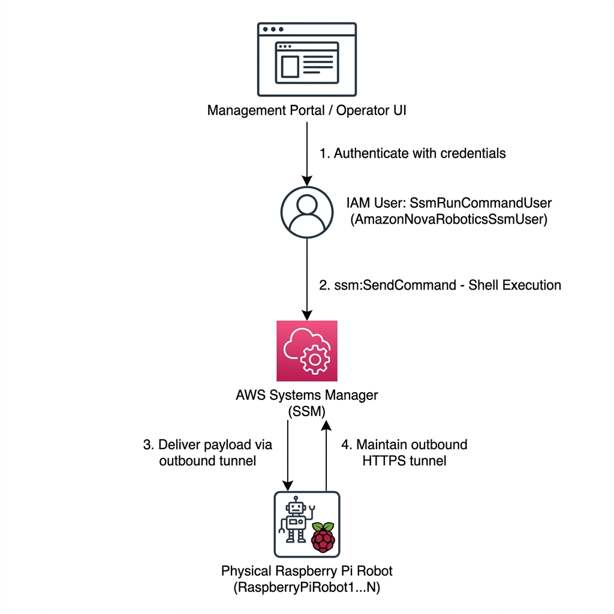

# Remote Command Execution & SSM Channels Design Specification (Robot SSM Channel)

This document details the architectural design of the remote diagnostics, system maintenance, and command execution framework for physical edge devices (Raspberry Pi robot controllers). This subsystem is co-implemented by **`SsmUserConstruct`** and **`RobotSsmConstruct`**, utilizing **AWS Systems Manager (SSM)** Hybrid Activations to deliver secure, zero-trust remote control.

---

## 1. Remote SSM Control Model

Physical edge devices in factories or homes are typically located behind restrictive NAT layers or within private subnets without public IP addresses. This prevents traditional SSH access and exposes major security attack surfaces.

By integrating **AWS Systems Manager (SSM)**, the system replaces dangerous inbound port mapping with a highly secure outbound long-polling HTTPS architecture:
1. **Outbound Tunneling**: The on-device Amazon SSM Agent opens a persistent outbound HTTPS connection (Port 443) to AWS SSM service endpoints. No inbound router ports (like Port 22 for SSH) ever need to be exposed.
2. **Automated Hybrid Activations**: During stack deployment, the system generates single-use activation parameters. Edge devices register as a `Managed Instance` automatically upon initial boot.
3. **Comprehensive Audit Logs**: Control platforms do not talk directly to edge devices. They invoke SSM `SendCommand`. Every single command execution, exit code, and terminal stdout is centrally logged in AWS CloudTrail and Systems Manager for 100% trace-compliance.



---

## 2. Automated Hybrid Activations (RobotSsmConstruct)

To allow newly assembled or provisioned robots to securely register with SSM without manual intervention, `RobotSsmConstruct` leverages a custom CloudFormation Custom Resource to generate hybrid activations.

### A. Core Architecture Components
* **SSMServiceRole**: Establishes an IAM service role trusted by `ssm.amazonaws.com` with strict source account (`aws:SourceAccount`) and source ARN (`aws:SourceArn`) conditions. This eliminates cross-account impersonation risks. The role is equipped with the `AmazonSSMManagedInstanceCore` managed policy.
* **Activation Lambda**: Deploys a Python 3.10 Lambda function with inline policies allowing `ssm:CreateActivation` and `ssm:DeleteActivation` calls.
* **Custom Resource (Per-Device)**:
  CDK loops over the specified `thingNames` (e.g., `["RaspberryPiRobot1", "RaspberryPiRobot2"]`), generating individual Custom Resources that invoke the Lambda function to generate distinct SSM activation parameters:
  ```typescript
  const customResource = new cdk.CustomResource(this, `SsmCustomResource${thingName}`, {
    serviceToken: lambdaFunction.functionArn,
    properties: {
      Prefix: props.prefix, // e.g., 'humanoid' or 'dog'
      ThingName: thingName,
    }
  });
  ```

### B. Output Output Mappings
The custom resource outputs the generated parameters, making them available as CloudFormation outputs:
```typescript
new cdk.CfnOutput(this, `ActivationIdOutput${thingName}`, {
  value: customResource.getAttString("ActivationId"),
});
```
Edge Raspberry Pi devices simply pull their designated `ActivationId` and `ActivationCode` during first-boot setups and execute `amazon-ssm-agent -register` to establish their outbound connection within seconds.

---

## 3. Fine-Grained Runtime Operator IAM Policies (SsmUserConstruct)

To allow the administrative web portal or control platform to securely dispatch commands without possessing global admin keys, `SsmUserConstruct` creates an isolated IAM User named `RobotSsmRunCommandUser` (physically resolved as `AmazonNovaRoboticsSsmUser`).

The user holds a highly restrictive, fine-grained IAM policy to prevent lateral privilege escalations:

### A. Strict Scope Boundaries & Policies

1. **Read-Only Inspection**:
   Limits informational queries to `ssm:List*`, `ssm:Describe*`, and `ssm:Get*` actions, restricting operators to active device lists and status views.
2. **Command Dispatch Control (`SendCommand`)**:
   Strictly restricts execution targets to registered SSM documents and system managed instances, preventing operators from accessing unrelated virtual machines or infrastructure:
   * **SSM Document Bounds**: `arn:aws:ssm:*:*:document/*`
   * **Managed Instance Bounds**: `arn:aws:ssm:*:*:managed-instance/*`
3. **Session Session Isolation**:
   To enable direct shell debugging, the user can start sessions, but session modification is strictly sandboxed via username variables:
   * **Resource Bounds**: `arn:aws:ssm:*:*:session/${aws:username}-*`
   * **Result**: Ensures operators can only resume (`ResumeSession`) or terminate (`TerminateSession`) their own active interactive terminals, blocking lateral session hijacking.

---

## 4. Subsystem Security Summary

By combining automated hybrid activations (`RobotSsmConstruct`) with strict fine-grained operator credentials (`SsmUserConstruct`), the system delivers:
* **Zero Open Inbound Ports**: Bypasses any network NAT configurations, avoiding standard SSH vulnerabilities.
* **Target Isolation**: Limits API calls to registered managed instances, keeping separate sandbox systems safe.
* **Full Audit trails**: Tracks every remote operation and its terminal stdout within AWS CloudTrail and Systems Manager log scopes for continuous compliance.
