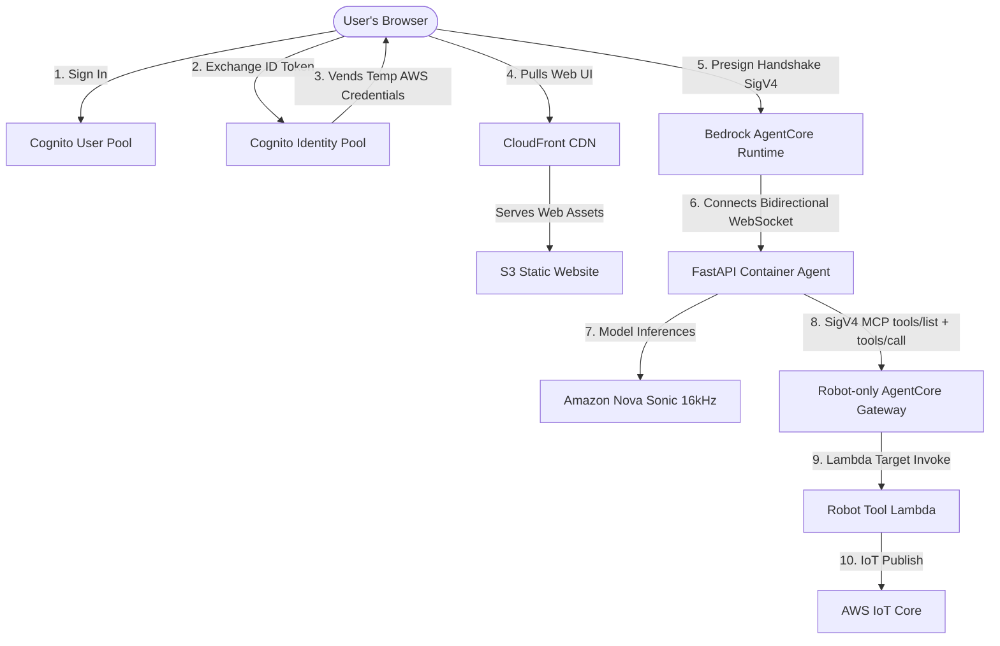

# Speech Control AgentCore Cockpit

A state-of-the-art, serverless voice-to-speech robotics fleet controller powered by **Amazon Bedrock AgentCore Runtime** and **Amazon Nova 2 Sonic**. 

This component enables natural, real-time bidirectional voice conversations to command physical and simulated hardware fleets (including humanoid robots, quadcopter drones, and digital humans).

---

## 🏗️ Architecture

This module implements a 100% serverless, zero-maintenance architecture:



1. **Serverless Static Hosting**: The user interface is a static HTML5/Vanilla CSS app hosted in an **Amazon S3 Website Bucket** and distributed globally via **Amazon CloudFront**.
2. **Federated Credentials**: The browser authenticates directly against **AWS Cognito User Pools** and exchanges identity tokens for temporary AWS credentials using a **Cognito Identity Pool**.
3. **IAM SigV4 Connection Pre-Signing**: The browser client generates a secure **AWS Signature Version 4** pre-signed WebSocket URL dynamically to authenticate directly at the Amazon Bedrock boundary, completely eliminating custom server-side proxy authentications!
4. **Bidirectional Streaming Loop**: The backend runs inside a lightweight, stateless Docker container managed serverlessly by AWS Bedrock AgentCore. It coordinates voice streaming inputs, tool executions, and real-time response generation.

---

## 🌟 Premium Capabilities

This cockpit features several advanced, state-of-the-art interactive systems:

* **16kHz Calibrated Sonic Voice**: Custom audio players are calibrated to match the native `16000 Hz` sampling rate of the Amazon Nova Sonic model, restoring natural-sounding, perfectly-paced speech responses.
* **Fluid Zero-Refresh Reconnect**: If a voice stream times out or disconnects, the UI automatically deactivates the microphone and returns to a resumable state. **Just click "Start Streaming" to resume without reloading the page.**
* **Grouped Device Selector**: Dropdowns utilize interactive HTML categories (`Robots`, `Drones`, `Digital Humans`) to let you target specific online devices if certain systems are powered off.
* **Smart "All" Mapping**: Selecting or saying "All" automatically translates to an explicit array covering the current active targets (`robot_1` through `robot_6`, `drone_1` to `drone_2`, and `xiaoice_1`), which allows the simulator to sync them consistently.
* **Real-time System Prompt Adaptation**: The FastAPI backend dynamically updates the AI model's `system_prompt` on selection change events. If you select only drones, the AI persona shifts to focus strictly on flight profiles; if you select only robots, it focuses on robot motion and telemetry.
* **Dual Live2D Lip Sync**: The left and right avatars now drive mouth movement from real playback and microphone RMS data with Cubism 2-safe parameter handling.

---

## 🚀 Running Locally

To run the voice control component locally for development:

### 1. Prerequisites
Ensure you have Python 3.8+ and standard AWS CLI credentials configured.

### 2. Run the Backend FastAPI Agent
```bash
# Install dependencies
pip install -r requirements.txt

# Start the agent service
python robot_voice_agent.py
```
The FastAPI microservice starts listening on port `8080` (with `/ws` and `/ping` endpoints active).

### 3. Serve the Static Web Console
Serve the static web assets under `public/` using any standard HTTP server:
```bash
cd public
python -m http.server 3000
```
Open **`http://localhost:3000`** in your browser to log in and start streaming!

---

## MCP Tool Loading Modes

This backend is configured for **AWS IAM (SigV4) authenticated MCP access** through the **robot-only Bedrock AgentCore Gateway**.

Required configuration:

1. Set `McpServerGatewayUrl` to the robot-only AgentCore Gateway URL.
2. Ensure the runtime IAM role can invoke the AgentCore Gateway.
3. Keep `MCP_REQUIRE_IAM=true` (default).

Optional IAM tuning:

- `MCP_AWS_SERVICE` (default: `bedrock-agentcore`)
- `AWS_DEFAULT_REGION` (default: `us-east-1`)

At runtime, the speech backend uses the native Strands `MCPClient` with `streamable_http_client` against the AgentCore Gateway. In this repo, the gateway itself is created with an **AWS_IAM** inbound authorizer, so the MCP HTTP transport must be signed with SigV4 for the `bedrock-agentcore` service. The speech runtime is granted gateway invoke permissions during CDK deployment.

For AWS AgentCore deployments, MCP tools are warmed during FastAPI startup to reduce first-turn latency. If warmup fails (for example, transient IAM/network issue), the service logs a warning and retries on first tool use.

### Exact tool naming contract

The speech runtime now uses the **exact AgentCore gateway-visible tool names** end-to-end. It does not rename them for the model.

For the dedicated robot gateway target:

- target name: `robot-only-mcp-lambda`
- tool name seen by the MCP client: `robot-only-mcp-lambda___robot_wave`

Important findings from the production debugging work:

1. AgentCore Lambda targets expose tools as `{target_name}___{tool_name}`.
2. The client must call `tools/call` with that **exact prefixed name**.
3. The Lambda target must strip the prefix before internal dispatch.
4. Trying to hide or normalize the name on the speech side created avoidable mismatch risk, so the current code keeps the raw gateway names.

### Lambda tool-name extraction contract

The robot-only Lambda now follows the documented AgentCore context contract instead of broad fallback parsing.

It resolves the tool name from:

- `context.client_context.custom.bedrockAgentCoreToolName`
- `context.bedrockAgentCoreToolName`

This was the key fix for the gateway error:

`Gateway request is missing a supported tool name. candidate_locations=[]`

### Debugging notes

- If tool warmup works but tool calls still fail, check **BedrockAgentCoreGateway_ApplicationLogs**.
- Those gateway logs are often more useful than the speech runtime logs for Lambda target invocation failures.
- Expected success logs now include the prefixed MCP tool name on the speech side and the stripped robot tool name inside `mcp_server/robot_tool_lambda.py`.

## Live2D lip-sync notes

The current lip-sync path is:

1. **Assistant speech** uses `AudioPlayer` playback RMS from the AudioWorklet.
2. **User speech** uses microphone RMS calculated in `main.js`.
3. `live2d-avatar.js` applies the mouth-open value across multiple Cubism 2-compatible parameter IDs:
   - `ParamMouthOpenY`
   - `PARAM_MOUTH_OPEN_Y`
   - `ParamMouthOpen`
   - `PARAM_MOUTH_OPEN`
   - `ParamA`

Important findings:

- A recent regression came from returning after the first attempted mouth parameter write.
- Some Live2D models require trying multiple mouth parameter IDs/API variants each frame.
- Frontend module cache-busting matters in staging. The `main.js` and `live2d-avatar.js` version query strings were bumped to ensure the fixed module is actually loaded.

### Testing Gateway connectivity

Fast unit coverage for the MCP integration lives in `backend/tests/test_mcp_gateway_unit.py`:

```bash
cd speech_control_agentcore/backend
python -m unittest tests.test_mcp_gateway_unit
```

There is also an opt-in live smoke suite for a deployed gateway in `backend/tests/test_mcp_gateway_live.py`:

```bash
cd speech_control_agentcore/backend
export McpServerGatewayUrl="https://..."
export AWS_DEFAULT_REGION="us-east-1"
export RUN_LIVE_MCP_GATEWAY_TEST=true
python -m unittest tests.test_mcp_gateway_live
```

To verify a real tool invocation as part of the smoke test, also set:

```bash
export MCP_SMOKE_TOOL_NAME="robot_some_safe_tool"
export MCP_SMOKE_TOOL_ARGS='{"robot_ids":["robot_1"]}'
```
