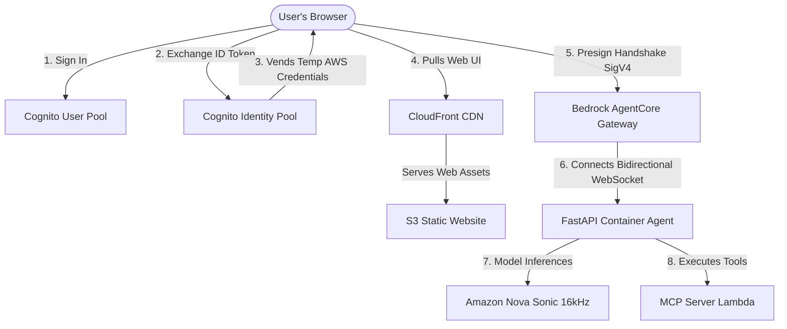

# Speech Control AgentCore Cockpit

A state-of-the-art, serverless voice-to-speech robotics fleet controller powered by **Amazon Bedrock AgentCore Runtime** and **Amazon Nova 2 Sonic**. 

This component enables natural, real-time bidirectional voice conversations to command physical and simulated hardware fleets (including humanoid robots, quadcopter drones, robotic dogs, and digital humans).

---

## 🏗️ Architecture

This module implements a 100% serverless, zero-maintenance architecture:



1. **Serverless Static Hosting**: The user interface is a static HTML5/Vanilla CSS app hosted in an **Amazon S3 Website Bucket** and distributed globally via **Amazon CloudFront**.
2. **Federated Credentials**: The browser authenticates directly against **AWS Cognito User Pools** and exchanges identity tokens for temporary AWS credentials using a **Cognito Identity Pool**.
3. **IAM SigV4 Connection Pre-Signing**: The browser client generates a secure **AWS Signature Version 4** pre-signed WebSocket URL dynamically to authenticate directly at the Amazon Bedrock boundary, completely eliminating custom server-side proxy authentications!
4. **Bidirectional Streaming Loop**: The backend runs inside a lightweight, stateless Docker container managed serverlessly by AWS Bedrock AgentCore. It coordinates voice streaming inputs, tool executions, and real-time response generation.

---

## 🌟 Premium Capabilities

This cockpit features several advanced, state-of-the-art interactive systems:

* **16kHz Calibrated Sonic Voice**: Custom audio players are calibrated to match the native `16000 Hz` sampling rate of the Amazon Nova Sonic model, restoring natural-sounding, perfectly-paced speech responses.
* **Fluid Zero-Refresh Reconnect**: If a voice stream times out (due to Bedrock's 55-second turn limits) or disconnects, the UI automatically deactivates the microphone and transitions back to an active state. **Just click "Start Streaming" to instantly resume talking without ever reloading the webpage!**
* **Grouped Device Selector**: Dropdowns utilize interactive HTML categories (`Robots`, `Drones`, `Dogs`, `Digital Humans`) to let you target specific online devices if certain systems are powered off.
* **Smart "All" Mapping**: Selecting or saying "All" automatically translates to an explicit array covering all twelve active targets (`robot_1` through `robot_6`, `drone_1` to `drone_2`, `dog_1` to `dog_3`, and `xiaoice_1`), which allows the simulator to sync them flawlessly.
* **Real-time System Prompt Adaptation**: The FastAPI backend dynamically updates the AI model's `system_prompt` on selection change events. If you select only drones, the AI persona shifts to focus strictly on flight profiles; if you select dogs, it limits itself to canine actions!

---

## 🚀 Running Locally

To run the voice control component locally for development:

### 1. Prerequisites
Ensure you have Python 3.8+ and standard AWS CLI credentials configured.

### 2. Run the Backend FastAPI Agent
```bash
# Install dependencies
pip install -r requirements.txt

# Start the agent service
python robot_voice_agent.py
```
The FastAPI microservice starts listening on port `8080` (with `/ws` and `/ping` endpoints active).

### 3. Serve the Static Web Console
Serve the static web assets under `public/` using any standard HTTP server:
```bash
cd public
python -m http.server 3000
```
Open **`http://localhost:3000`** in your browser to log in and start streaming!
